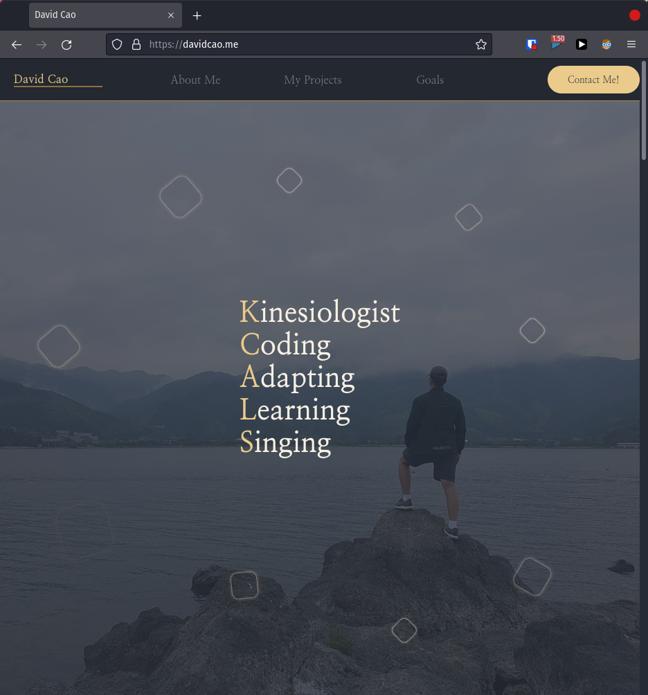

# David's Portfolio

**Everything in this portfolio was made in plain HTML, CSS, and JS**

This is a restarted project in which I realized my old portfolio just wasn't cutting it.
I also took a year break from learning how to code because of school which had nothing to do with coding.

At this point I forgot a lot of things about HTML and CSS. Therefore, during the summer, I decided to revamp my website while also refreshing my knowledge on coding.

**Check out my portfolio at: https://davidcao.xyz**

---

## What I Learned

1. I relearned all the HTML syntax like links, sections, bullets, etc.
2. I learned how to make HTML forms and it's intricacies
3. I learned the horrors and beauties of CSS
4. I learned how cool Javascript can be (although it does make the site somewhat slow)

---

## Continuing On

-   Continuing on in my coding journey, I will continue to learn through the freeCodeCamp track
-   The next on the list is Front-End Frameworks
-   Next, I will make a website based on React

### Side Note

-   As a side note, I have sidetracked a little on my learning path by getting into Linux, VIM, bash, and python
-   I have posted my dotfiles as well as a Daily Logger made from bash scripts in one of my public repositories

---

> _All the knowlege that I got from coding can be contributed to freeCodeCamp.com_
